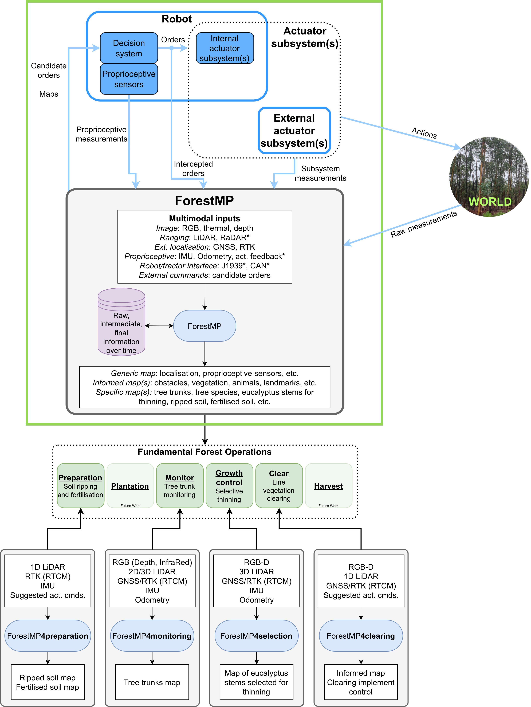

# Projects

## <a href="https://www.inesctec.pt/pt/projetos/agendatransform" target="_blank">AgendaTransform</a>

  
  
Agenda for the digital transformation of the forestry sector for a resilient and low-carbon economy.

___

## Ph.D. Thesis - <a href="https://www.researchgate.net/publication/384288274_Multimodal_Perception_for_Robotics_in_Forestry_Operations" target="_blank">Multimodal Perception for Robotics in Forestry Operations</a>

  
  
Forest fires constitute not only an environmental problem with natural resources destruction and ecological degradation, but also a societal problem where human lives can be at stake. The integration of robotic solutions and advanced perception systems can facilitate the optimal management of forest resources, enhance the productivity of forestry tasks, and increase the profitability of forest stands. Nevertheless, perception at stand-level in forests is a domain with a great potential to grow, being underdeveloped compared to airborne or spaceborne remote sensing. This thesis was developed within this scope with the goal of achieving a multimodal and multipurpose perception system for robotics in forestry operations at stand-level. A multipurpose and multimodal system called ForestMP was designed to handle multiple sensors of different natures and fuse the information into meaningful perceptions that can be used in robotic forestry operations. The system at hand can intervene at least in four distinct forestry operations: forest soil preparation before plantation (soil ripping and fertilisation), forest environment monitoring (tree trunk monitoring and mapping), forest species growth control (eucalyptus selective thinning), and forest areas maintenance (line vegetation clearing).

___

## <a href="https://www.inesctec.pt/en/projects/smartcut" target="_blank">SMARTCUT</a>

Remote Diagnosis and Maintenance and Simulators for Operation and Maintenance Training of Forestry Machines.

___

## <a href="https://www.inesctec.pt/pt/projetos/replant" target="_blank">rePLANT</a>

  
  
Implementation of collaborative strategies for integrated forest and fire management.

___

## M.Sc. Dissertation - <a href="https://hdl.handle.net/10216/132839" target="_blank">Computer Vision System for Tactode Programming</a>

  <iframe src="https://www.youtube.com/embed/AexTj4I-ry8" frameborder="0"
  allow="accelerometer; autoplay; clipboard-write; encrypted-media; gyroscope; picture-in-picture" allowfullscreen
  style="width: 480px; height: 480px; margin-right: 25px; border-radius: 10px;"></iframe>
  
Tangible programming, when applied to robotics, makes programming more understandable and straightforward. This type of programming helps children developing their abilities of programming and computational thinking interactively and at earlier stages of their lives. From this idea came Tactode: a tangible programming system composed by puzzle-like pieces and a web application that aims robot programming. The target users of this system are children who, using the pieces, build a tangible code, take a picture of it and then can upload it to the application to be tested and executed on the robot later. The Tactode project is developed based on ArUco markers, meaning that each piece have a marker of this type that facilitates its detection and distinction in the tangible code. Therefore, this dissertation will continue this project through the development of a computer vision system capable of detecting and identifying each piece in photographed Tactode codes without depending on the ArUco markers.

GitHub repository: <a href="https://github.com/daniqsilva25/tactode_recognition" target="_blank">https://github.com/daniqsilva25/tactode_recognition</a>

___

## The Maze in QVGA

  <iframe src="https://www.youtube.com/embed/yIrrkUGHrhg" frameborder="0"
  allow="accelerometer; autoplay; clipboard-write; encrypted-media; gyroscope; picture-in-picture" allowfullscreen
  style="width: 550px; height: 350px; margin-right: 25px; border-radius: 10px;"></iframe>
  
Maze game based of a Arduino Due controlling a QVGA interface for a visual screen.

